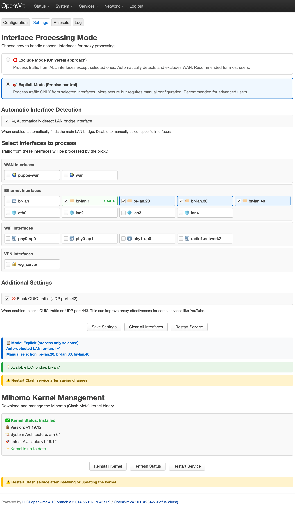

<h1 align="center">
  
  <br>Super Simple Clash для Mihomo<br>
</h1>

<h3 align="center">Установка и настройка SSClash на OpenWrt</h3>

# Установка

## Шаг 1: Обновить список пакетов
Обновитесь, чтобы убедиться, что у вас самые свежие версии.

```bash
opkg update
```

## Шаг 2: Установка зависимостей
Необходимо установить модуль ядра для nftables.

```bash
opkg install kmod-nft-tproxy
```

Если у вас старая версия OpenWrt (ниже 22.03), у вас iptables, нужен – `iptables-mod-tproxy`.

```bash
opkg install iptables-mod-tproxy
```

## Шаг 3: Скачать и установить `luci-app-ssclash`
Загрузите вручную или командой и установите.

```bash
curl -L https://github.com/fildunsky/SSClash/releases/download/v1.8.2.3-do/luci-app-ssclash_1.8.2.3-do-r1_all.ipk -o /tmp/luci-app-ssclash.ipk
opkg install /tmp/luci-app-ssclash.ipk
rm /tmp/*.ipk
```

## Шаг 4: Скачайте ядро Mihomo
Важно выбрать правильную архитектуру для процессора вашего роутера. Ядро необходимо положить в `/opt/clash/bin`

```bash
cd /opt/clash/bin
```

Для **arm64** - Xiaomi AX3000T, Netis N6, GL-MT3000, Cudy TR3000, Huasifei WH3000:

```bash
curl -L https://github.com/MetaCubeX/mihomo/releases/download/v1.19.8/mihomo-linux-arm64-v1.19.8.gz -o clash.gz
```

Для **mipsel_24kc**:

```bash
curl -L https://github.com/MetaCubeX/mihomo/releases/download/v1.19.8/mihomo-linux-mipsle-softfloat-v1.19.8.gz -o clash.gz
```

[Другие архитектуры](https://github.com/MetaCubeX/mihomo/releases).

## Шаг 5: Подготовка ядра
Распакуйте скачанный файл и выдайте ему права на исполнение.

```bash
gunzip clash.gz
chmod +x clash
```

## Шаг 6: Управление Clash из интерфейса LuCI
В [Zerolab.net](https://github.com/zerolabnet/SSClash) создали простой интерфейс для управления Clash из интерфейса LuCI `luci-app-ssclash`. Вам необходимо отредактировать конфиг прежде чем запускать Clash.

<p align="center">
 
</p>

## Шаг 7: Доступ в панель Dashboard по кнопке из LuCI интерфейса или вручную
Когда Clash запущен, стандартно панель висит на 9090 порту:

```
http://ROUTER_IP:9090/ui/
```

<p align="center">
 
</p>

# Удаление Clash
Чтобы удалить Clash, удалите его файлы, пакет `luci-app-ssclash` и модуль ядра `kmod-nft-tproxy` или `iptables-mod-tproxy`.

```bash
opkg remove luci-app-ssclash kmod-nft-tproxy iptables-mod-tproxy
rm -rf /opt/clash
```

Подробное [Wiki по настройке Clash](https://ssclash.notion.site/Super-Simple-Clash-15989188f6b48051a97fc887adea736a).